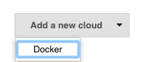
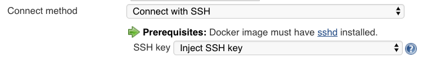

# Docker plugin for Jenkins

[](https://plugins.jenkins.io/docker-plugin)
[](https://plugins.jenkins.io/docker-plugin)
[](https://ci.jenkins.io/job/Plugins/job/docker-plugin/job/master/)

#### Overview

This plugin allows containers to be dynamically provisioned as Jenkins nodes using Docker.
It is a Jenkins Cloud plugin for Docker.

The aim of this docker plugin is to be able to use a
[Docker](https://docs.docker.com/)
host to dynamically provision a docker container as a Jenkins agent node,
let that run a single build,
then tear-down that node,
without the build process (or Jenkins job definition)
requiring any awareness of docker.

The Jenkins administrator configures Jenkins with
knowledge of one or more docker hosts (or swarms),
knowledge of one or more "templates"
(which describe
the labels/tags that this template provides,
the docker image,
how to start it,
etc)
and Jenkins can then run docker containers to provide Jenkins (agent) Nodes on which Jenkins can run builds.

#### See also
* [Software licence](LICENSE)
* Support and [contribution guide](CONTRIBUTING.md)
* [Changelog](CHANGELOG.md)

----

**Note:** There is _more than one docker plugin_ for Jenkins.
While this can be confusing for end-users, it's even more confusing when end users report bugs in the wrong place.
e.g. if you are using Jenkins
[pipeline / workflow / Jenkinsfile](https://jenkins.io/doc/book/pipeline/docker/)
builds with code including terms like
`docker.withDockerRegistry`
or
`docker.image`
etc then you're using the
[`docker-workflow`](https://plugins.jenkins.io/docker-workflow)
plugin and should go to its repository instead of this one.

----

**Note:** This plugin does not _provide_ a Docker daemon; it allows Jenkins to _use_ a docker daemon.
i.e. Once you've installed docker on your OS, this plugin will allow Jenkins to use it.

----

# Setup

A quick setup is :

1. get a docker environment running
1. follow the instructions for creating a docker image that can be used
as a Jenkins Agent

### Docker Environment

Follow the installation steps on [the docker website](https://docs.docker.com/).

If your Jenkins instance is not on the same OS as the docker install,
you will need to open the docker TCP port so that Jenkins can communicate with the docker daemon.
This can be achieved by editing the docker config file and setting (for example)

```sh
DOCKER_OPTS="-H tcp://0.0.0.0:2376 -H unix:///var/run/docker.sock"
```

The docker configuration file location will depend your system, but it
is likely to be
`/etc/init/docker.conf`
,
`/etc/default/docker`
or
`/etc/default/docker.io`.


### Multiple Docker Hosts

If you want to use more than just one physical node to run containers,
you can use
[Docker Swarm Standalone](https://github.com/docker/swarm)
or you can define more than one docker "cloud".
The docker engine swarm mode API is not supported
(at present; enhancement contributions would be welcomed).

To use the standalone swarm,
follow docker swarm standalone instructions and configure Jenkins with the swarm's API endpoint.


### Jenkins Configuration

Docker plugin is a "Cloud" implementation.
You'll need to edit Jenkins system configuration
(Jenkins -> Manage -> System configuraiton)
and add a new Cloud of type "Docker".



Configure Docker (or Swarm standalone) API URL with required credentials.
The test button lets you check the connection.

Then configure Agent templates,
assigning them labels that you can use so your jobs select the appropriate template,
and set the docker container to be run with whatever container settings you require.


### Creating a docker image

You need a docker image that can be used to run Jenkins agent runtime.
Depending on the launch method you select, there's some prerequisites
for the Docker image to be used:

#### Launch via SSH

-   [sshd](https://linux.die.net/man/8/sshd) server and a JDK installed.
    You can use
    [jenkins/ssh-agent](https://hub.docker.com/r/jenkins/ssh-agent/)
    as a basis for a custom image.
-   a SSH key (based on unique Jenkins master instance identity) can be
    injected in container on startup, you don't need any credential set
    as long as you use standard openssl sshd.  
      
    For backward compatibility *or* non-standard sshd packaged in your
    docker image, you also have option to provide manually configured
    ssh credentials
-   **Note:** If the docker container's host SSH key is not trusted by
    Jenkins (usually the case) then you'll need to set the SSH host key
    verification method to "non-verifying".

#### Launch via JNLP

-   a JDK installed.
    You can use
    [jenkins/inbound-agent](https://hub.docker.com/r/jenkins/inbound-agent/)
    as a basis for a custom image.
-   Jenkins master URL has to be reachable from container.
-   container will be configured automatically with agent's name and
    secret, so you don't need any special configuration of the container.

#### Launch attached

-   a JDK installed.
    You can use
    [jenkins/agent](https://hub.docker.com/r/jenkins/agent/)
    as a basis for a custom image. 

To create a custom image and bundle your favorite tools,
create a `Dockerfile` with the `FROM` to point to one of the
jenkins/\*-agent
reference images,
and install everything needed for your own usage, e.g.

```
FROM jenkins/inbound-agent
RUN apt-get update && apt-get install XXX
COPY your-favorite-tool-here
```


#### Note on ENTRYPOINT

Avoid overriding the docker command, as the SSH Launcher relies on it.

You _can_ use an Entrypoint to run some side service inside your build agent container before the agent runtime starts and establish a connection
... but you MUST ensure your entrypoint eventually runs the passed command:

    exec "$@"

## Further information

More information can be obtained from the online help built into the Jenkins WebUI.
Most configurable fields have explanatory text.
This,
combined with knowledge of [docker itself](https://docs.docker.com/),
should answer most questions.

# Configure plugin via Groovy script

Jenkins can be configured using Groovy code, and the docker plugin is no exception.
For example, this
[configuration script](docs/attachments/docker-plugin-configuration-script.groovy)
could be run automatically upon
[Jenkins post-initialization](https://wiki.jenkins.io/display/JENKINS/Post-initialization+script)
or through the
[Jenkins script console](https://wiki.jenkins.io/display/JENKINS/Jenkins+Script+Console).
If run,
this script will configure the docker-plugin to look for a docker daemon running within the same OS as the Jenkins master
(connecting to Docker service through `unix:///var/run/docker.sock`)
and with the containers connecting to Jenkins using the "attach" method.
